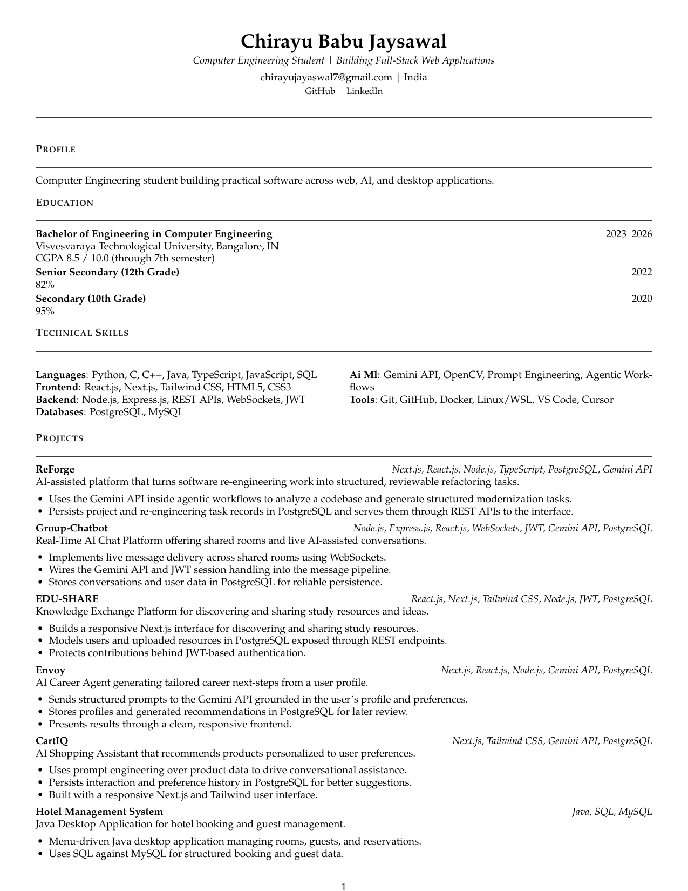

<div align="center">

# Chirayu Babu Jaysawal

**Computer Engineering Student | Full-Stack / Software Engineering**

</div>

---

## Interactive Resume

Explore my resume across multiple visual templates — switch between the
**ATS**, **Modern**, and **Developer** layouts, preview each one, and open or
download the matching PDF, all in a single page:

🚀 [Open Interactive Resume](https://crusty-chirayu.github.io/chirayu-resume/)

The showcase displays the actual outputs of this repository's build pipeline
(general profile × each template); it contains no duplicated resume data.

## Resume Preview

Click the preview to open or download the latest PDF.

[](https://github.com/Crusty-chirayu/chirayu-resume/releases/latest/download/Chirayu-Babu-Jaysawal-latest.pdf)

📥 [Download Latest PDF](https://github.com/Crusty-chirayu/chirayu-resume/releases/latest/download/Chirayu-Babu-Jaysawal-latest.pdf)

📚 [Browse Historical Releases](https://github.com/Crusty-chirayu/chirayu-resume/releases)

---

## Resume-as-Code

This repository generates role-specific resumes from one verified source of
truth. The latest PDF and the README preview image are produced from the exact
same build, so the preview always matches the document it links to.

```text
master-data.yaml
       ↓
profile YAML
       ↓
LaTeX template
       ↓
build.py
       ↓
generated LaTeX
       ↓
PDF  ──▶ first-page PNG preview
```

## Available Profiles

- `general`: broad computer engineering profile (used for the latest default PDF)
- `fullstack`: frontend, APIs, databases, and full-stack projects
- `java`: Java, SQL, backend, and the Hotel Management System project
- `ai-ml`: AI products, Gemini API, OpenCV, and agentic workflows
- `software-engineer`: balanced programming, APIs, databases, and tooling

## Available Templates

- `ats`: conservative typography and spacing for machine readability (used for the latest default PDF)
- `modern`: larger hierarchy and restrained blue accent
- `developer`: compact layout with a green monospace technical accent
- `minimal`: airy, typography-first design with no rules or color
- `executive`: premium senior-engineer style with navy accent-bar headings
- `technical`: dense engineering layout with numbered headings and monospace details
- `editorial`: magazine-inspired serif with hairline rules and italic display type
- `terminal`: bracketed monospace headings and prompt-style bullets with a green accent

Templates are real LaTeX inputs, so changing the template changes the generated
document rather than only its filename.

## Build

Install Python dependencies and a TeX distribution with XeLaTeX:

```bash
python -m pip install -r requirements.txt
python build.py --profile general --template ats
```

The PDF is written to `dist/Chirayu-Babu-Jaysawal-general-ats.pdf`.
Use `--validate-only` to generate and inspect LaTeX without a local compiler.

## Repository Structure

```text
.
├── master-data.yaml          # single source of truth (personal info, skills, projects)
├── build.py                  # Resume-as-Code generator
├── profiles/                 # role-specific profile definitions
├── templates/                # LaTeX templates (ats, modern, developer)
├── generated/                # generated LaTeX (build output; git-ignored)
├── dist/                     # compiled PDFs (build output; git-ignored)
├── tests/                    # source-generation and PDF-validation tests
├── .github/workflows/        # CI matrix build + preview/release publishing
├── resume-preview.png        # first-page preview of the latest PDF (CI-generated)
├── requirements.txt
└── LICENSE
```

## Updating The Resume

Edit `master-data.yaml` for personal information, education, skills, projects,
experience, and certifications. The generator validates required fields and
escapes LaTeX-sensitive characters.

To add a project, add an entry with a unique `id`, `title`, and factual
`description`, then include its id in the profiles where it belongs. Add skills
to the appropriate master-data category and reference that category in a
profile's `skills` list.

To create a profile, add `profiles/<name>.yaml` with `name`, `summary`,
`skills`, and `projects`. To create a template, add `templates/<name>.tex` with
the style commands used by `build.py`, then pass that template name to the
build command.

## CI/CD

GitHub Actions runs the full 5 profiles x 8 templates matrix (40 combinations) on
pushes and pull
requests. Each of the 15 jobs installs dependencies, generates LaTeX, compiles
with XeLaTeX, parses the PDF, checks identity and links, checks page count, and
uploads the resulting PDF as an artifact.

On pushes to `main`, a `publish` job then:

1. Renders the first page of the canonical `general/ats` PDF to `resume-preview.png`.
2. Commits that preview image back to the repository.
3. Publishes a GitHub Release (marked as latest) hosting the canonical PDF at
   the stable URL used by the README preview and the download button.

The latest PDF is always available at:

```text
https://github.com/Crusty-chirayu/chirayu-resume/releases/latest/download/Chirayu-Babu-Jaysawal-latest.pdf
```

Historical builds are listed on the [Releases](https://github.com/Crusty-chirayu/chirayu-resume/releases) page.

A separate, minimal `deploy-showcase` workflow reuses `build.py` and the same
XeLaTeX compile step to publish the [Interactive Resume](https://crusty-chirayu.github.io/chirayu-resume/)
to GitHub Pages with the ATS / Modern / Developer previews and PDFs. The
existing resume matrix workflow is unaffected.

## Tests

Run the local source-generation matrix with:

```bash
python -m unittest discover -s tests -p "test_*.py"
```

The local environment used to prepare this repository does not contain a TeX
compiler, so local PDF compilation is reported as unavailable by `build.py`.
PDF compilation and validation are performed by GitHub Actions.